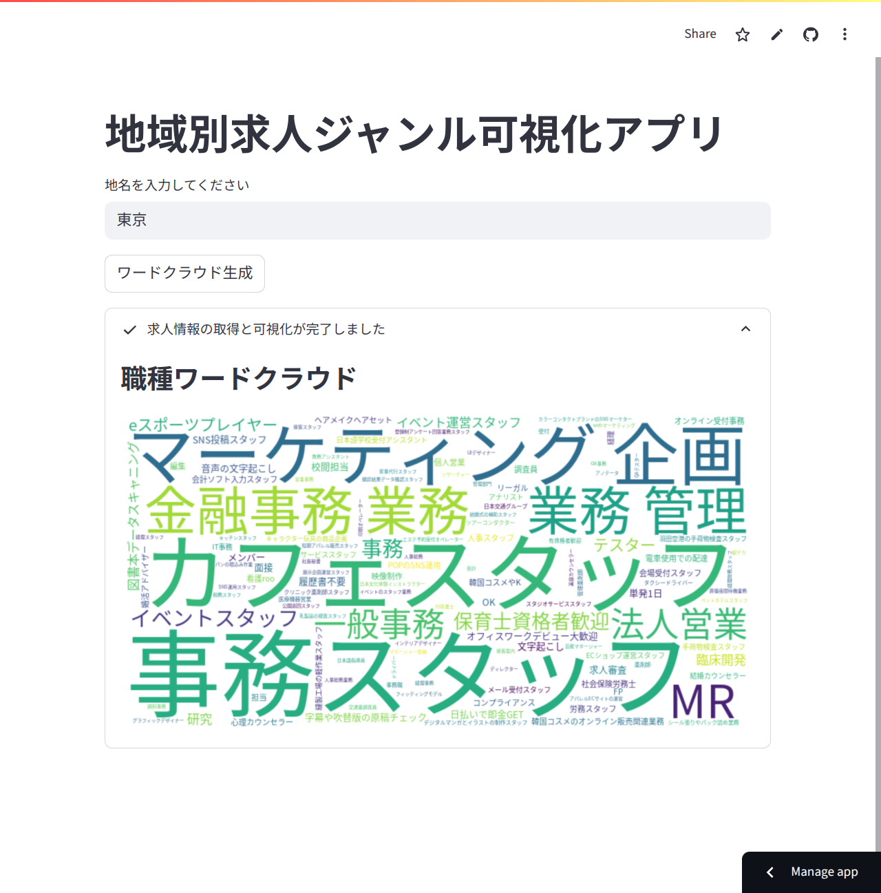

# 地域別求人ジャンル可視化アプリ

このアプリは、指定した地域の求人情報から職種ジャンルを取得し、ワードクラウドで可視化する Web アプリケーションです。

<p align="center">
  
</p>

## 公開URL

[https://job-wordcloud-yxzvqxmksx4xmufzfptwo6.streamlit.app/](https://job-wordcloud-yxzvqxmksx4xmufzfptwo6.streamlit.app/)

## 機能概要

- 地名を入力すると、スタンバイ（jp.stanby.com）から求人情報を取得します。
- 求人タイトルから主要な職種を抽出し、ワードクラウドで視覚的に表示します。

## 使用技術

- Python
- Streamlit
- BeautifulSoup
- WordCloud
- matplotlib

## ファイル構成

```
job-wordcloud-app/
├── src/
│   ├── app.py                    # Streamlit アプリ本体
│   ├── get_job_titles.py         # 求人情報取得処理
│   └── visualize.py              # ローカルテスト用可視化処理
├── images/                        # 可視化の例
├── fonts/
│   └── NotoSansCJK-Regular.ttc   # 日本語対応フォント
├── requirements.txt
└── README.md
```

## 実行方法（ローカル）

1. 必要なライブラリをインストール：

```bash
pip install -r requirements.txt
```

2. アプリを起動：

```bash
streamlit run src/app.py
```

3. ブラウザが自動で開かない場合は、出力されたURLを開いてください。

## 補足

- 公開環境（Streamlit Cloud）でも日本語を正しく表示するため、`fonts/NotoSansCJK-Regular.ttc` を明示的に指定しています。
- フッターに含まれる不要な情報は除外済みです。